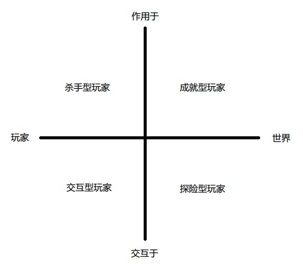
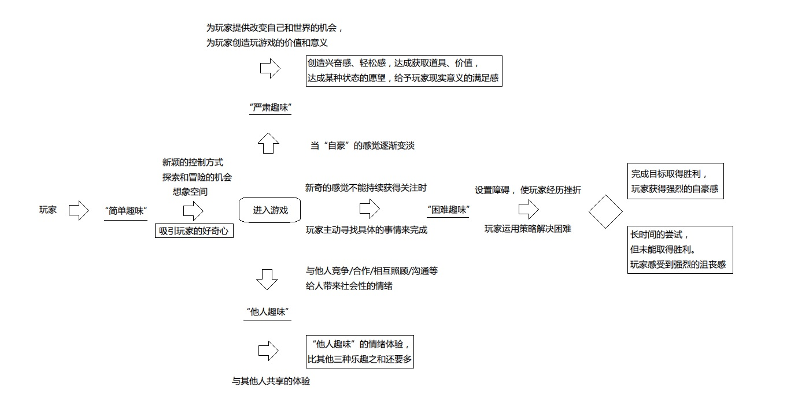

# 游戏设计的100个原理
### 该笔记用于记录一些重点的内容
### 作者：Wendy Despain
---

1. 游戏的对称性/非对称性和同步性  
    + 对称性：面对面的实体乒乓球、面对面的实体国际象棋等（多人游戏玩家在同一时间看到相同场景）
    + 非对称性：《龙与地下城（D&D）》，狼人杀等（Dungeon Master/上帝能知道所有正在发生的事情，其他玩家只知道一部分，或者特殊技能看到的其他玩家看不到的事物如：陷阱）
    + 同步性：《马里奥赛车》（玩家同时在线时看到几乎相同的画面）
2. A最大，鬼万能  
设置一个游戏过程中被所有人认可的规则
3. 玩家分类理论（巴特尔）  
    - 成就型玩家（Achievers）：主要关注如何在游戏中取胜或达成某些特定目标的玩家群体，该目标可能为游戏固有或玩家自定目标。
    - 探险型玩家（Explorers）：尝试在虚拟世界系统中寻找一切他们能找到的东西。
    - 社交型玩家（Socializers）：享受在游戏中与其他人的互动。
    - 杀手型玩家（Killers）：喜欢把自己的意愿强加给其他人的玩家群体。可分两类：在游戏中杀人显示自己强大/骚扰或激怒他人。  

4. 合作与对抗
5. 公平  
游戏对玩家必须是公平的，必须不偏不倚，不能对玩家作弊。  
游戏难度在逐步提高的过程中出现大飞跃，也是对玩家的一种不公平。
    - 拉宾的公平模型（适用于多人游戏）  
    第一，对于友好的人，其他人愿意牺牲他们的物质利益。  
    第二，玩家将会愿意损失自己的物质利益去惩罚那些不友好的玩家。  
    第三，第一和第二条规则在物质损失越小的情况越容易发生。  

    当玩家觉得游戏给了他们不公平的对待时,他们有可能退出游戏。  
    当玩家觉得其他玩家给了他们不公平的对待时，他们有可能去惩罚其他玩家。
6. 反馈循环  
“富人越富，穷人越穷”问题
    - 正反馈循环：达成目标获得奖励，以便于继续目标更容易达成。  
    （RPG游戏：打怪升级，升级以更容易的打怪；国际象棋：吃棋使对手变弱，以更容易吃掉对手的棋子）
    - 负反馈循环：达成一个目标会让下一个目标更难达成。  
    （《马里奥赛车》：第一名意味着可能会被蓝龟壳击中，从而失去第一名的位置）
    - 橡皮筋回弹机制：二者相结合，用于调控奖励。
7. 多元智能理论（加德纳）  
我们每一个人在认知方式上都有各自的长处和短处。在认知学习过程中，有的人会觉得很容易，有的人觉得很难，但是并不意味着学不好，而是自身学习的方式不适合。  
    - 人有八种不同的智能/认知方式：
        1. 数理逻辑认知：通过批判性思维和逻辑来认知的过程。
        2. 空间认知：通过想象将物体在空间中的情形视觉化来认知的过程。
        3. 语言认知：以听觉或书面的方式，通过文字来认知的过程。
        4. 身体-运动认知：通过身体或者周围的物理世界的移动来认知的过程。
        5. 音乐认知：通过各种和音乐有关的东西，如音调、旋律、节奏和音色来认知的过程。
        6. 人际交往认知：在与其他人的互动中来认知的过程。
        7. 内省认知：自我反省和认知的过程。
        8. 自然探索认知：从周围相关的自然环境中认知的过程。
8. 隐匿性游戏设计法则（霍华德）（注：还没理解）  
秘密的重要性 ∝ 其表面看来的无辜性 × 完整度  
(Secret Significance ∝ Seeming Innocence × Completeness)  
游戏刚开始的时候看起来越像是一个单一维度的、独立的体验，其后故事或游戏性发生转折的时候带来的冲击力越大。
9. 信息  
游戏在不同点展现出来的信息类型和级别，可以极大地影响整个游戏的玩法。
游戏相关的信息可以采取不同的形式：
    1.  游戏的结构：所有游戏的类别中最首要的一个是游戏的结构，包括游戏的设定和规则（跳棋的移动）。游戏环境本身也应被视为信息（国际象棋记谱法可以用来确定棋盘布局和棋子位置）。如果一个游戏中的随机元素被作为参数，而不是一个固定值来考虑，它也是一条明确的信息（大富翁，玩家不知道下一步可以走多远，但知道是由骰子决定）。  
    2. 游戏的状态：游戏在任何一个点的状态也是一种信息。（单位元素所处的位置、分数、资源的情况等）  

    游戏相关的信息可以以由其分类呈现：
    1. 完全信息：玩家知晓关于游戏的每一件事。（环境/规则/当前位置/所有物品的状态/当前游戏阶段/...)
    2. 不完全信息： 一部分信息对某一个或更多的玩家是隐藏的，玩家利用对信息的掌握和探索作为“核心游戏循环”。（《狼人杀》）  
10. 游戏理论（科斯特-《游戏快乐之道》）  
所有游戏其实是低风险的学习工具，要让每一个游戏在某种程度上都是寓教于乐的。一旦没有的学习，游戏就不再好玩了。  
在设计游戏中用到“组块化”的概念，“组块化”是一个将复杂的任务分解成我们能够下意识地完成事情的过程。  
在一个游戏中学会如何达成游戏目标，就是“快乐”的来源。  
游戏设计的目标就是重组大脑的思维范式，这是一个非常严肃的责任。  
11. 四种关键趣味元素（拉扎罗）  
玩家对游戏的热忱来自于玩家最喜欢的那些动作引发情绪体验的方式。  
游戏机制创造玩家在游戏中的情绪体验，而这些情绪体验又回过头驱动玩家对游戏的热忱。  
人们玩游戏有以下四种原因：
    1. 简单趣味：玩家对一种新的体验感到好奇，被带入到这种体验中去并且开始上瘾。
    2. 困难趣味：游戏提供了一个可供追求的目标，并将其分解成一个一个可以达成的步骤。目标达成过程中的种种障碍给玩家带来挑战，让他们发展出新的战略和技能来实现“困难趣味”
    3. 他人趣味：当朋友也跟你一起玩的时候，胜利的感觉会更强烈。竞争、合作、沟通和领导结合到一起，增加参与度。
    4. 严肃趣味：玩家通过游戏来改变他们自己和他们的世界。（射击游戏→宣泄不满；脑筋急转弯→锻炼智力；跳舞→减肥）从游戏的节奏、重复、收集、完成中得到刺激和放松，创造了价值也推动他们参与。  

    这四种关键趣味元素主要关注游戏玩家在他们的游戏过程中做的最多的行为。通常在一个游戏过程中他们对这四种趣味元素的追求是交替进行着的。由于每一种元素会给他们带来不同的事情去完成和不一样的情绪感受，玩家会发现这样交替进行会让他们保持新鲜感，并且延长游戏的时间。  
    
12. 魔法圈  
游戏的一大特点是：它是一种幻想，是一种独立于真实世界的存在。  
但当“这只是一个游戏”不再只是一个游戏，魔法圈的界限就被丢诸脑后了。
13. 采取行动（游戏中的博弈）  
依据博弈各方做决定或采取行动的先后关系，可以被区分为：
    - 同步博弈：
        博弈者必须考虑其他人会采取什么样的行动，但是不能肯定他们到底会做什么。“其他玩家在做什么”这样的信息会对每一步走下来的后果产生影响，但这些信息对于博弈者在做自己每一步的决策时并不可见。
    - 序贯博弈：每个博弈者能得到更多的信息。他们能通过其他人刚刚采取的行动，对其下一步行动进行可靠的预测。
14. 游戏的机制、运行和体验（MDA:Mechanice, Dynamics, and Aesthetics）  
所有游戏都可以被分解为以下组成要素：
    - 游戏的机制，是整个系统的规则。它定义了系统如何处理玩家的输入，玩家能看到什么和做什么。
    - 游戏的运行，讲的是在玩游戏的过程中整个系统的各个参与者的行为。
    - 游戏的体验，是在游戏运行的影响下玩家的情感输出。  

    MDA的实践：
    1. 游戏设计师以定义在游戏中想要达到的体验效果作为设计流程的开始，然后确定要达到这样的体验效果，玩家需要参与什么样的游戏过程，最终在为这样的运行过程设置游戏的机制。  
    （体验→运行→机制）
    2. 玩家反向体验MDA的三个要素并且首先与游戏机制进行互动，这些机制会带来特定的游戏运行，而这又将让玩家产生特定的体验。
    （机制→运行→体验）  

    MDA能帮你回答的问题：  
    + 这些机制将创造怎样的玩家行为？
    + 这些行为是符合你的游戏的期望的吗？
    + 如果规则改变，对游戏的运行会有什么样的影响？
    + 你的游戏想要达到什么样的目的？
    + 哪些机制和你想要达到的目的是契合的，哪些是对立的？  
15. 记忆和技巧  
广义的，将游戏分为记忆游戏和技巧游戏。但许多游戏对于二者都有涵盖。  
- 记忆游戏中，需要用到试错法、记忆识别、本能反应以及对游戏本身的掌握。  
该种游戏可能会在玩了一段时间之后让玩家感到无聊，因为玩家一直在玩一样的游戏，用同样的方式，在同样的区域，使用同样的工具或武器。所以可以在不改变机制、故事和结果的前提下增加一点随机性，如在不同级别中让敌人在不同的地方出现，跳跃平台以不同的速度往不同的方向移动，物品掉落的方式和地点不同。  
游戏中的记忆也可用于提升现实世界中的技能。
- 技巧游戏中，需要体能或者精神上的实力和条件来完成。  
如果玩家没有达到游戏特定部分所需要的技能，玩家会感到越来越沮丧。设计师可以通过给予玩家提示、将多余物品隐藏以突出主要物品等方式间接帮助玩家达成目标。