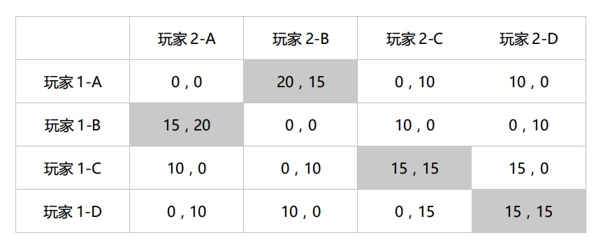
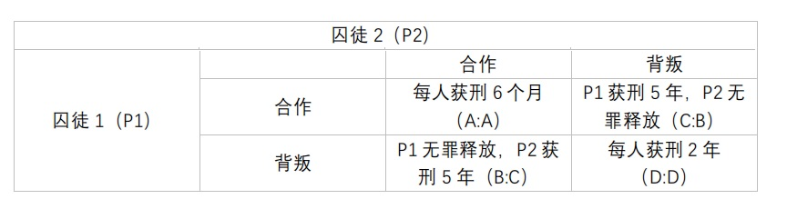

# 游戏设计的100个原理
### 该笔记用于记录一些重点的内容
### 作者：Wendy Despain
---
## 一、游戏创新的一般原理
---
1. 游戏的对称性/非对称性和同步性  
    + 对称性：面对面的实体乒乓球、面对面的实体国际象棋等（多人游戏玩家在同一时间看到相同场景）
    + 非对称性：《龙与地下城（D&D）》，狼人杀等（Dungeon Master/上帝能知道所有正在发生的事情，其他玩家只知道一部分，或者特殊技能看到的其他玩家看不到的事物如：陷阱）
    + 同步性：《马里奥赛车》（玩家同时在线时看到几乎相同的画面）
2. A最大，鬼万能  
设置一个游戏过程中被所有人认可的规则
3. 玩家分类理论（巴特尔）  
    - 成就型玩家（Achievers）：主要关注如何在游戏中取胜或达成某些特定目标的玩家群体，该目标可能为游戏固有或玩家自定目标。
    - 探险型玩家（Explorers）：尝试在虚拟世界系统中寻找一切他们能找到的东西。
    - 社交型玩家（Socializers）：享受在游戏中与其他人的互动。
    - 杀手型玩家（Killers）：喜欢把自己的意愿强加给其他人的玩家群体。可分两类：在游戏中杀人显示自己强大/骚扰或激怒他人。  

4. 合作与对抗
5. 公平  
游戏对玩家必须是公平的，必须不偏不倚，不能对玩家作弊。  
游戏难度在逐步提高的过程中出现大飞跃，也是对玩家的一种不公平。
    - 拉宾的公平模型（适用于多人游戏）  
    第一，对于友好的人，其他人愿意牺牲他们的物质利益。  
    第二，玩家将会愿意损失自己的物质利益去惩罚那些不友好的玩家。  
    第三，第一和第二条规则在物质损失越小的情况越容易发生。  

    当玩家觉得游戏给了他们不公平的对待时,他们有可能退出游戏。  
    当玩家觉得其他玩家给了他们不公平的对待时，他们有可能去惩罚其他玩家。
6. 反馈循环  
“富人越富，穷人越穷”问题
    - 正反馈循环：达成目标获得奖励，以便于继续目标更容易达成。  
    （RPG游戏：打怪升级，升级以更容易的打怪；国际象棋：吃棋使对手变弱，以更容易吃掉对手的棋子）
    - 负反馈循环：达成一个目标会让下一个目标更难达成。  
    （《马里奥赛车》：第一名意味着可能会被蓝龟壳击中，从而失去第一名的位置）
    - 橡皮筋回弹机制：二者相结合，用于调控奖励。
7. 多元智能理论（加德纳）  
我们每一个人在认知方式上都有各自的长处和短处。在认知学习过程中，有的人会觉得很容易，有的人觉得很难，但是并不意味着学不好，而是自身学习的方式不适合。  
    - 人有八种不同的智能/认知方式：
        1. 数理逻辑认知：通过批判性思维和逻辑来认知的过程。
        2. 空间认知：通过想象将物体在空间中的情形视觉化来认知的过程。
        3. 语言认知：以听觉或书面的方式，通过文字来认知的过程。
        4. 身体-运动认知：通过身体或者周围的物理世界的移动来认知的过程。
        5. 音乐认知：通过各种和音乐有关的东西，如音调、旋律、节奏和音色来认知的过程。
        6. 人际交往认知：在与其他人的互动中来认知的过程。
        7. 内省认知：自我反省和认知的过程。
        8. 自然探索认知：从周围相关的自然环境中认知的过程。
8. 隐匿性游戏设计法则（霍华德）（注：还没理解）  
秘密的重要性 ∝ 其表面看来的无辜性 × 完整度  
(Secret Significance ∝ Seeming Innocence × Completeness)  
游戏刚开始的时候看起来越像是一个单一维度的、独立的体验，其后故事或游戏性发生转折的时候带来的冲击力越大。
9. 信息  
游戏在不同点展现出来的信息类型和级别，可以极大地影响整个游戏的玩法。
游戏相关的信息可以采取不同的形式：
    1.  游戏的结构：所有游戏的类别中最首要的一个是游戏的结构，包括游戏的设定和规则（跳棋的移动）。游戏环境本身也应被视为信息（国际象棋记谱法可以用来确定棋盘布局和棋子位置）。如果一个游戏中的随机元素被作为参数，而不是一个固定值来考虑，它也是一条明确的信息（大富翁，玩家不知道下一步可以走多远，但知道是由骰子决定）。  
    2. 游戏的状态：游戏在任何一个点的状态也是一种信息。（单位元素所处的位置、分数、资源的情况等）  

    游戏相关的信息可以以由其分类呈现：
    1. 完全信息：玩家知晓关于游戏的每一件事。（环境/规则/当前位置/所有物品的状态/当前游戏阶段/...)
    2. 不完全信息： 一部分信息对某一个或更多的玩家是隐藏的，玩家利用对信息的掌握和探索作为“核心游戏循环”。（《狼人杀》）  
10. 游戏理论（科斯特-《游戏快乐之道》）  
所有游戏其实是低风险的学习工具，要让每一个游戏在某种程度上都是寓教于乐的。一旦没有的学习，游戏就不再好玩了。  
在设计游戏中用到“组块化”的概念，“组块化”是一个将复杂的任务分解成我们能够下意识地完成事情的过程。  
在一个游戏中学会如何达成游戏目标，就是“快乐”的来源。  
游戏设计的目标就是重组大脑的思维范式，这是一个非常严肃的责任。  
11. 四种关键趣味元素（拉扎罗）  
玩家对游戏的热忱来自于玩家最喜欢的那些动作引发情绪体验的方式。  
游戏机制创造玩家在游戏中的情绪体验，而这些情绪体验又回过头驱动玩家对游戏的热忱。  
人们玩游戏有以下四种原因：
    1. 简单趣味：玩家对一种新的体验感到好奇，被带入到这种体验中去并且开始上瘾。
    2. 困难趣味：游戏提供了一个可供追求的目标，并将其分解成一个一个可以达成的步骤。目标达成过程中的种种障碍给玩家带来挑战，让他们发展出新的战略和技能来实现“困难趣味”
    3. 他人趣味：当朋友也跟你一起玩的时候，胜利的感觉会更强烈。竞争、合作、沟通和领导结合到一起，增加参与度。
    4. 严肃趣味：玩家通过游戏来改变他们自己和他们的世界。（射击游戏→宣泄不满；脑筋急转弯→锻炼智力；跳舞→减肥）从游戏的节奏、重复、收集、完成中得到刺激和放松，创造了价值也推动他们参与。  

    这四种关键趣味元素主要关注游戏玩家在他们的游戏过程中做的最多的行为。通常在一个游戏过程中他们对这四种趣味元素的追求是交替进行着的。由于每一种元素会给他们带来不同的事情去完成和不一样的情绪感受，玩家会发现这样交替进行会让他们保持新鲜感，并且延长游戏的时间。  
    
12. 魔法圈  
游戏的一大特点是：它是一种幻想，是一种独立于真实世界的存在。  
但当“这只是一个游戏”不再只是一个游戏，魔法圈的界限就被丢诸脑后了。
13. 采取行动（游戏中的博弈）  
依据博弈各方做决定或采取行动的先后关系，可以被区分为：
    - 同步博弈：
        博弈者必须考虑其他人会采取什么样的行动，但是不能肯定他们到底会做什么。“其他玩家在做什么”这样的信息会对每一步走下来的后果产生影响，但这些信息对于博弈者在做自己每一步的决策时并不可见。
    - 序贯博弈：每个博弈者能得到更多的信息。他们能通过其他人刚刚采取的行动，对其下一步行动进行可靠的预测。
14. 游戏的机制、运行和体验（MDA:Mechanice, Dynamics, and Aesthetics）  
所有游戏都可以被分解为以下组成要素：
    - 游戏的机制，是整个系统的规则。它定义了系统如何处理玩家的输入，玩家能看到什么和做什么。
    - 游戏的运行，讲的是在玩游戏的过程中整个系统的各个参与者的行为。
    - 游戏的体验，是在游戏运行的影响下玩家的情感输出。  

    MDA的实践：
    1. 游戏设计师以定义在游戏中想要达到的体验效果作为设计流程的开始，然后确定要达到这样的体验效果，玩家需要参与什么样的游戏过程，最终在为这样的运行过程设置游戏的机制。  
    （体验→运行→机制）
    2. 玩家反向体验MDA的三个要素并且首先与游戏机制进行互动，这些机制会带来特定的游戏运行，而这又将让玩家产生特定的体验。
    （机制→运行→体验）  

    MDA能帮你回答的问题：  
    + 这些机制将创造怎样的玩家行为？
    + 这些行为是符合你的游戏的期望的吗？
    + 如果规则改变，对游戏的运行会有什么样的影响？
    + 你的游戏想要达到什么样的目的？
    + 哪些机制和你想要达到的目的是契合的，哪些是对立的？  
15. 记忆和技巧  
广义的，将游戏分为记忆游戏和技巧游戏。但许多游戏对于二者都有涵盖。  
- 记忆游戏中，需要用到试错法、记忆识别、本能反应以及对游戏本身的掌握。  
该种游戏可能会在玩了一段时间之后让玩家感到无聊，因为玩家一直在玩一样的游戏，用同样的方式，在同样的区域，使用同样的工具或武器。所以可以在不改变机制、故事和结果的前提下增加一点随机性，如在不同级别中让敌人在不同的地方出现，跳跃平台以不同的速度往不同的方向移动，物品掉落的方式和地点不同。  
游戏中的记忆也可用于提升现实世界中的技能。
- 技巧游戏中，需要体能或者精神上的实力和条件来完成。  
如果玩家没有达到游戏特定部分所需要的技能，玩家会感到越来越沮丧。设计师可以通过给予玩家提示、将多余物品隐藏以突出主要物品等方式间接帮助玩家达成目标。
16. “极小极大”与“极大极小”
不同于“最小/最大化”（Min/Maxing）。
“极小极大”（Minimax）指出在一个零和博弈中，博弈者会选择一个能最大化他们回报的混合策略，由此产生的策略和回报的组合是“帕累托最优”。在经济博弈论中，极小极大原理常被用来降低机会成本。适用于机会主义者或乐观主义者，他们的决策目标是让对手得到最小回报。但并不见得总是选择让自己的获得最大成功的选项，因为那不一定能减少他们对手的收益。
“极大极小”（Maximin），它应用于非零和博弈。极大极小原理解决的问题是玩家致力于防止最差的结果，想要避免错误决定导致的最坏结果。适用于杞人忧天者或悲观主义者，他们会做出保守的决定来避免自己得到负面的汇报。他们倾向于选择最不会带来可怕结果的选项，关心的是将自己的最小收益最大化。
17. 纳什均衡  
任意一个混合策略博弈中 有这样一个策略组合,在该策略组合上，任何参与人都有有限的选择；而当其他所有人都不改变策略的时候，没有人会改变自己的策略，因为改变策略会导致该博弈者的得益降低，那么这个策略组合就是纳什均衡。  
该原理用于预测博弈者在他们最优策略的基础上互动的结果。纳什均衡仅在博弈各方都对博弈可能的决策和结果有共识的情况下有效。  
纳什均衡可通过基于回报矩阵得出，在参与人数不多和可用策略不多情况下才好用。若一个单元格中的第一个回报数字和第二个回报数字都分别是该行和该列中最高的，那么这个单元格所描述的情形就是纳什均衡。  
如果博弈者在纳什均衡的情况下反复进行，博弈者之间的重复互动会带来形成一个长期策略的基础，并取代任何统计预测的结果。博弈者之间选择的合作性会更大，这在博弈者能够只有沟通的情况下尤其明显。   

18. 帕累托最优（帕累托效率）  
如果一个交换过程在改进了系统中一个人的状态的情况下没有直接损害系统中其他人的利益，这个变化就是一个“帕累托改进”（如RPG系统中的角色升级）；  
通常参与双方都可以进行帕累托改进，甚至进行多次。当一个系统达到了没有帕累托改进的余地的状态，他就达到了“帕累托最优”（帕累托效率）。这时，系统中的任何一个交换都是零和的，这个交换将损害系统中至少一方的利益。
19. 得益  
指在游戏中一个决定所带来的产出或结果（包含积极的和消极的）。  
不是所有玩家玩游戏都是出于追求同样的回报。有一些玩家是为了得到高的分数或升到高的级别，有一些玩家则对他们能种出多少种花更感兴趣。  
假定所有玩家都是理性自利的，每个人的行为都以获得自己的最佳回报，并且将其最大化为目的，根据玩家自己的价值体系，每个决定对玩家带来的影响都是合理的。尽管有时玩家会去做他们认为对自己团队最好的事情，期望它也能给自己本人带来有利影响，但通常理性自利意味着玩家的决定是只为自己的利益打算的，并不考虑对其他玩家带来的影响。  
在博弈论中，得益可被分为基数的，和序数的：
    - 基数得益：是固定的值，用可计量的货币、点数或其它可用之物做计算单位。基数回报是定量的，有特定的数目。这种回报可以设置在不同层级来区别结果之间的不同关系。（如：具体数值，1或0，是或非，有或无）
    - 序数得益：采用得益产生的顺序而不在于其数值的大小来描述结果。序数得益是相对的比较值，从最好到最差排序（1，2，3，8，......，12），赢家居于排序之顶第1号。  
注：在平衡一个游戏的得益时，决策过程中的理性自利（没有与其他玩家之间的可信承诺）通常会给玩家带来最坏的结果。（如“囚徒困境”，双方合作（不采用理性自利），他们会同时得到对自己而言第二好的结果。而他们如果分别都选择能让自己被释放的做法，他们反而都会被判更长的刑期。）我们要注意尽管这个游戏看起来是基数得益的，他实际上却是序数得益的。（详见20.囚徒困境）  
20. 囚徒困境  
你会背叛你在犯罪活动中的搭档还是与他合作（来骗过警察）？其核心在于双方在合作还是背叛对方的问题上如何决策。
  
只要B>A>D>C并且它们是成比例的，游戏是不需要对称的。  
简要地讲，囚徒困境是两个博弈者在博弈时会分别作出不是对自己最有利的，却能通过合作达成一个更好结果的选择。
博弈者的策略要获得成功的四个必要条件：
    1. 要友好。不要首先背叛（尽可能的合作）。
    2. 不嫉妒。不要试图比对方得到更多（优化平均积分）。
    3. 要报复。当对方背叛你时一定要报复（不要永远合作）。
    4. 要宽容。报复之后要改回合作（如果对方不背叛你的话）。  

    一些非传统的方法：  
    - 随即背叛：博弈者随机选择合作还是背叛，这样在面对比较友好的对手时能获得一些小利益。
    - 巴甫洛夫回馈：博弈者在每一次对手做出与自己上一轮所做的同样的事情时选择合作。
    - 团队合作：使用“最小/最大化”策略。指派团队中某些成员故意输掉，以让其他成员能赢。(背叛的合谋计划)  
21. 解密游戏的设计  
设计谜题的时候，要确保：  
    - 在难度上要让玩家保持在一个“心流”的状态。
    - 需要一个聪明、智慧的解决方法。
    - 是确定的。
    - 从其目标和机制上来说是明确而公平的。
22. 石头剪刀布（循环制约关系）  

    

        <table border="0">
            <tr>
                <th></th>
                <th>石头</th>
                <th>布</th>
                <th>剪刀</th>
            </tr>
            <tr>
                <td>石头</td>
                <td>平局</td>
                <td>布胜</td>
                <td>石头胜</td>
            </tr>
                <tr>
                <td>布</td>
                <td>布胜</td>
                <td>平局</td>
                <td>剪刀胜</td>
            </tr>
            <tr>
                <td>剪刀</td>
                <td>石头胜</td>
                <td>剪刀胜</td>
                <td>平局</td>
            </tr>
        </table>
    
   

    这个博弈有着完美的平衡，一个循环的制约关系：石头>剪刀>布>石头。  
    这种循环制约关系被应用于其他游戏，以防止占优策略的演进，保证游戏过程中各种类型的元素保持同等的价值。  
    一个需要注意的问题是，石头剪刀布有时也被一些不愿意去探索更有趣的、创新或独特的方法来平衡游戏机制的设计师当作偷懒的依托。如果该方式是针对功能设计的唯一策略时就要小心了。  

23. 七种通用情感  
    1. 惊讶
    2. 轻蔑
    3. 愤怒
    4. 喜悦 
    5. 恐惧
    6. 悲伤
    7. 厌恶  

    游戏经常利用游戏中角色表现出这些通用情感，由于图形化的处理比直接观察面部表情更为直接，这种表现能够达到更好的沟通效果，即使是稍纵即逝的一个表情。由于这些通用情感表达的应用，玩家能够随着游戏中的人物表情的变化，更多的了解人物，并于他们建立起同类的认同和情感联系。  
24. 斯金纳箱  
斯金纳箱引出的一个错误的结论：  
    > 玩家与游戏的交互等同于价值，因此最能引导玩家与游戏产生更多互动的交互方式是以随机的周期给用户奖励。  

    这种结论引发的问题是：
    > 玩家对这个游戏是否“好玩”抱有矛盾的意见，但却承认自己被吸引不停地玩。

    然而，只要运用得当，这种理论是可以被当作一个推动玩家参与的妙招的。  
    - 在玩家获胜时可以用提供玩家获得一定数量金币的机会来替代直接给他们一个金币（可变奖励vs固定奖励）。
    - 可以奖励玩家与系统的互动机会，来替代按照玩家游戏的一定时间或是可变时间段给予他们奖励（基于比例vs基于时间间隔）。

    目标的梯度效应：  
    - 当人们越接近自己的目标的时候，他们就越有动力去完成它。
        > 买咖啡的策略：  
        > 买10杯咖啡获得1杯免费。（越到快凑齐10杯时，人们越会购买更多咖啡以得到1杯免费）  
        > 买12杯咖啡获得1杯免费，前两杯免费。（前两杯免费的策略会让人们感觉到更接近目标）

        > RPG游戏的升级策略：
        > 玩家有100 EXP，需要50 EXP升到下一级。  
        > 在100 EXP时是空的，到150 EXP才会填满经验条；  
        > 在0-150 EXP的经验条，其中0-100 EXP部分已经被填满了，玩家需要填满剩下的50 EXP。 

    - 当玩家知道自己将马上得到奖励，会更有动力去完成能让他们得到这个奖励的任务。  
    （如果你的玩家在游戏中的某一点逐渐失去他们的兴趣，或许这就是向他们展示如果继续下去将得到建立的最佳时机。）
25. 社会关系  
对于大部分玩家来说，游戏是一项群体活动，不管是棋盘游戏、卡牌游戏，还是视频游戏。哪些曾经流行的“大杀四方”的多人游戏已经日渐衰落，让位于社交游戏的爆发性增长。这些社交性、合作性的游戏的发展证明在游戏设计中的社会关系对增加玩家的兴趣、参与和满意度是非常有效的。  
    + 邓巴数理论：  
        - 任何一个人的社交网络大概由150个链接，也就是社会关系构成。这是一般人能够与之稳定的关系，与他们互相了解，从中受益的人数。  
    + 网络外部效应（网络效应的概念）：
        - 你能从你的社交网络中的每一个个体中得到的好处，包括互相帮助、互相访问，或通过其他手段帮助彼此。  

    + 六度分隔（凯文·培根）：
        > 你说出两个明星的名字，你的朋友需要用少于6部电影将两位明星联系起来。  
        例如：你说A和B  
        你朋友得出以下的回答：  
        1、  A和C同时出演了XXX那部电影  
        2、  C和D同时出演了XXXX那部电影  
        3、  D和B同时出演了X那部电影  
        于是A和B仅仅用了三部电影就联系起来了。  

    为什么玩家与其社交网络中的社会关系互动会给我们带来好处？
    > 因为这件吸引玩家始终对游戏保持兴趣。
    
    社交机制可以使主动的、被动的，也可以介于两者之间。排行榜促进竞争，互赠礼品促进合作。其都在玩家和他们的朋友之间建立起正反馈循环，从而加强了游戏的影响力。这反过来又可以提高游戏的粘性，减少玩家流失。心理现象“害怕错过”，这是个体寻求能帮助他们被纳入团体的经验的一个很有说服力的理由。  
    我们应该考虑如何通过竞争或者合作来激活游戏中的社会关系，从而帮助游戏设计。尤其是在网络】社交或移动游戏平台，玩家已经习惯了这样的机制。设计师需要评估他们的射击是否能与好友请求、游戏评分的提示、礼物互赠循环、高分的竞争、非同步的玩家之间的竞赛（游戏的对称性/非对称性/同步性），或者更为传统的玩家对战系列赛或合作游戏的模式等机制相得益彰。  
    目标受众的偏好和他们的舒适区都会影响与社会关系相关的设计的一般方法。如：一些玩家强烈希望合作而不是竞争（而这些玩家的需要在过去通常都得不到满足）。研究受众的喜好并巧妙地使用社交设计方法能够将游戏的复杂性和娱乐性提高一个档次，并最终帮助游戏从市场竞争中脱颖而出。  

26. 公地悲剧  
如果一项资源是可供所有人使用的，那么该资源最终一定会被耗尽，这对所有人都是有害的，长期的损失远大于短期内获取该资源得到的好处。但是由于没有一个人认为自己该对这个损失负责，他们往往不会承认自己的责任，也不会减少自己对该资源的使用。  
公地悲剧的假定条件是在有限的系统内对资源的使用是增长的（使用资源的人口是增长的，而资源本身不会增加）。  
广义讲，公地悲剧表达了一个人艰难的选择：努力争取物质利益，并由此导致自己和他人的长期损失——寄希望于短期的物质利益能弥补长期损失——或者为了所有人的利益与大家合作来节约资源，但是这样做的风险是，如果有其他人有更好的个人资源，或者有其他人谎称合作实则过度使用公共资源，这个主张合作的人就吃亏了。  
游戏中，玩家策略或游戏机制可能导致公地悲剧。固定顺序的游戏有可能让第一个行动的玩家有机会捞一大把，而同步博弈的游戏可能会导致所有玩家都试着能捞就捞——因为他们认为其他玩家也会这么做——这样就平等的降低了所有玩家的可用资源。在两种情况下都应该有某种协议（或一些特殊的规则来奖励使用资源较少的玩家）来预防玩家萌使用完所有可用资源。  
很多游戏的设计都是围绕着有趣的，困难的抉择，公地悲剧恰恰就是这样一个情况。没有一个明显的、简单的解决方案，玩家会遇到更多的挑战，并有机会去探索不被太多人注意的区域。  
27. 信息透明  
许多游戏都是围绕着发现隐藏信息的过程而展开的。它们将人类对学习的喜爱（科斯特的游戏理论）带入到下一个境界：人类对于挖掘他人秘密的喜爱（霍华德的隐匿性游戏设计法则）。在这些游戏中，探索和试验都是“核心游戏循环”的组成部分。  
游戏理论将这些信息不透明的游戏归类为“不完全信息游戏”。这样的信息透明度（信息透明度的匮乏），应用于各类型的游戏信息，包括游戏的结构和游戏的状态（信息）。  
“战争迷雾”（fog of war），很多视频游戏甚至一些桌游利用了这种巧妙地做法来隐藏一部分地图，鼓励玩家进行探索（巴特尔的玩家分类理论）。与之类似的是，还有一些视频游戏的复杂构思有时候会模糊掉自然地因果关系，如道德系统或社会关系系统。这些情况下被隐藏的信息是游戏底层结构的信息。  
另一种信息——游戏状态，则在不完全信息游戏的分类下还有所细分。这种区别取决于玩家能够接触到多少信息、何种类型的信息——也就是说，各种类型的信息有多透明。  
- 完整信息：  
在不完全信息游戏中有一个子分类，这类游戏中玩家能够接触到关于游戏环境和规则的所有信息，但不能看到其他玩家的行动状态，这就是完整信息的游戏（完整但不完全信息）。  
- 不完整信息：  
在不完全信息游戏中，那些玩家没有依据对未知进行假设的游戏就是不完整信息的游戏。  
- 非自愿信息透明
- 自愿信息透明
28. 大五人格游戏理论（范登伯格）（注：还没弄全懂..）
“大五人格理论”（Big 5），又称“人格的海洋”（O.C.E.A.N)。
大五理论认为人类的行为主要是由5类动机驱动的：  
+ 对体验的开放性（Openness to Experience)，这一点将那些有创造力、有想象力的人和那些更务实、跟循规蹈矩的人区分开来；
+ 尽责性（Consciousness），人如何控制和缓和自己的冲动情绪；
+ 外倾性（Extraversion），这一点将那些追求刺激以及在他人面前的存在感的人，与那些不这么做的人区分开来；
+ 随和性（Agreeableness），反映人如何处理与社会和谐的规则相关的问题；
+ 神经质或情绪稳定性（Neuroticism），这反映了一个人是否选择经历（或不经历）负面情绪的倾向。  
more veiw->https://baike.baidu.com/item/%E5%A4%A7%E4%BA%94%E4%BA%BA%E6%A0%BC%E7%90%86%E8%AE%BA/7065662?fr=aladdin  
范登伯格在一些主要的游戏行业会议上针对这个概念发表演说，指出游戏设计师如何将玩家在这30个子维度的得分和他们对游戏的偏好关联起来，举两个重要的例子：  
    - 与想象力相关联的是玩家对幻想的写实的偏好。在“想象力”一项中得到高分的人倾向于偏爱发生在一个与现实世界不同的奇异世界中的游戏，而低分的人则会偏爱一个发生在跟相似世界类似的世界中的游戏。  
    - 与冒险性相关联的是玩家更喜欢将探索作为游戏机制的一部分，期待遇到新的事物（追求高分），还是更喜欢像建造、种地或其他跟“本土”的游戏机制，不需要他们离开已知的边界（追求低分）。  

    这些关联在整个大五人格理论体系中都存在。这向我们指出一条让我们不舒服却不可回避的真理：
    > “我们抱着同样的目的生活和游戏。”

    完全理解这一点是很重要的。我们希望在游戏中扮演别人的看法很普遍，但这是错误的。在有些情况下人们在游戏中体现出与真是生活中不同的个性，而实际上这种“不同的个性”在大五人格测试的分数中还是会体现出来。通常这样的人在正常生活中没有途径表达他们人格中的这一面，所以将游戏作为一个表达途径。然而这样的动机依然是他们人格中的一部分。我们抱着同样的目的生活和游戏。要理解人类在游戏中的行为，大五理论是一个很好的开始。
29. 志愿者困境  
群体博弈理论中的一个特殊例子。志愿者困境中，一个人面临的选择是，是否牺牲自己的一小部分利益，来让群体中的所有人受益，同时这个人自己不能得到任何额外的好处。而如果这个人不牺牲，并且也没有其他人这么做，则所有人都要面临严重的利益损害。当然，这个选择是，自己牺牲一小部分时间、经历、钱等等，或是承担等着其他人来做的风险。  
---
二、游戏创作的一般原理
---
30. 80/20法则（帕累托法则）  
- 80/20法则帮助人们集中精力在投资回报比最高的功能上，以及帮助避免有害的功能过剩。  
- 这个理论参数的是，80%的价值是由20%的控制因素产生或驱动的。该发这在游戏中的体现显而易见，例如，在80%的游戏体验过程中，只有20%的功能会被使用。  
- 尽管很多华丽的功能被大肆吹捧，玩家将他们大部分时间（80%左右）花在基本功能上（通常是20%左右的功能），如跳跃、战斗、升级或得分（核心游戏循环）。开发人员需要认识到这一点，并将更多时间花在完善这些核心功能和修复它们的漏洞上。  
- 在通常情况下，在一个新游戏中，当玩家还没有真正建立起自己的角色，他将有可能多次重复进入游戏。也就是说通常游戏的开始阶段将被重复的次数远远多于结尾阶段。这是游戏开发过程中应该投入相当多经历的地方——或许需要达到80/20的比例。

31. 头脑风暴的方法
头脑风暴（Brainstorming），一些最基本的头脑风暴方法可以在一个人面对书写工具和空白的石板时自然而然地产生——这些东西可以被看成是创意的空间。不管使用的是何种方法，这通常是一个最好的生发点，而此时唯一可能的限制，就是头脑风暴纷至沓来时，自己头脑中是否有足够的空间来产生和记录想法。
    - 自由思考法
    当我们并不需要一个有特定结构的创意时，这种类型的方法就很适用。其要义时创造一个开放的讨论环境，允许思想的自由流动，并且没有一定要产生特定结果的压力。
        + “单词气泡”和“创意网”
        从写下一个或更多单词或是创意开始。我们以此为生发点，添加更多单词或是创意并将其连接到生发点，还会关联到这个创意空间中的其他单词或者创意。这就创造了一个像蜘蛛网一样相互联结的创意图谱。在游戏开发的开始阶段，当游戏设计师仅仅对游戏有一些最基本的想法，或是对这个游戏简要叙述的故事有一些基本情节的设想时，这个方法是有效的。
    - 结构思考法
    尽管自由思考在开发的开始阶段会帮助我们带来丰富的好创意，但随着游戏设计过程的进行，我们在稍后的阶段会需要一些结构性的头脑风暴。
        + 流程图和树形图
        当游戏开发需要构思一个有序的结构时，流程图非常有用，他其中的每一个想法延伸至下一步，不至于产生太多的偏差和分支。而在游戏开发过程中，当需要设计师创造一个分层次的项目或者动作时，树形图将会非常有用。
    - 身体表现法
    头脑风暴不必局限于把所有想法写下来，设计师应该把他们演示出来。身体风暴利用肢体的动作来协助创意的过程，他对于设计复杂的角色运动或者（随着动作控制的诞生）新的控制机制非常有帮助。

32. 消费者剩余  
设想，有50000个想玩一个新游戏的人。将玩游戏的人分为五类：
    - A是一个经济困难的大学生。他喜欢游戏但基本上不会付钱买他们。他不愿意为它们付出任何金钱。
    - B喜欢游戏，并且对这个新游戏很好奇。他有可能会花1美元买它，但不愿意付出更多了。
    - C喜欢这个游戏，并且最多愿意付30美元来一直玩下去。
    - D非常喜欢这个游戏，他愿意付最多60美元，一直玩到他玩腻为止。
    - E是一个狂热粉丝。他愿意为这个游戏花500美元。  

    现在，对游戏开发商来说，理想的情况是，他们能满足没一个群体的需要，并且让他们都为这个游戏付出的最多的钱。10000个B将每人付1美元，10000C将每人付30美元，10000个D将每人付60美元，而10000个E将每人付500美元。  
    但在现实中游戏开发商不能这么做。在商店里我们通常给商品标上一个统一的价格，所有人都支付这个价格。如果游戏售价被设定为60美元，D和E们回去购买它，但A，B，C们不会。如果游戏的售价被设定为1美元，BCDE们都会去买他，但是对于游戏开发商来说就损失了很大一笔钱。E们本来愿意付500美元，为什么只让他们付了1美元？这个中间的差额就叫“消费者剩余”。  
    而免费增值（Free-to-Play，F2P）模式给游戏开发商带来好处的是所有的5类人——从A到E——都有机会参与到游戏中来，并且能够根据他们愿意支付的金额来为游戏付钱。具体操作方式是游戏免费对所有人开放，开发商通过收买游戏中的道具和特权来诱使玩家付出他们所愿意支付的金额来为游戏付钱，从而获利。通过获取这其中的消费者剩余，游戏开发商将在激烈的市场竞争中最大程度获取经济利益。  
    数字分发渠道以及现代的付款方式让消费者对游戏的投资性更具灵活性，他们呢可以为自己喜爱的游戏想花多少钱就花多少钱。而开发者们可以利用期货去的消费者剩余来进行下一步的研发。
33. 核心游戏循环