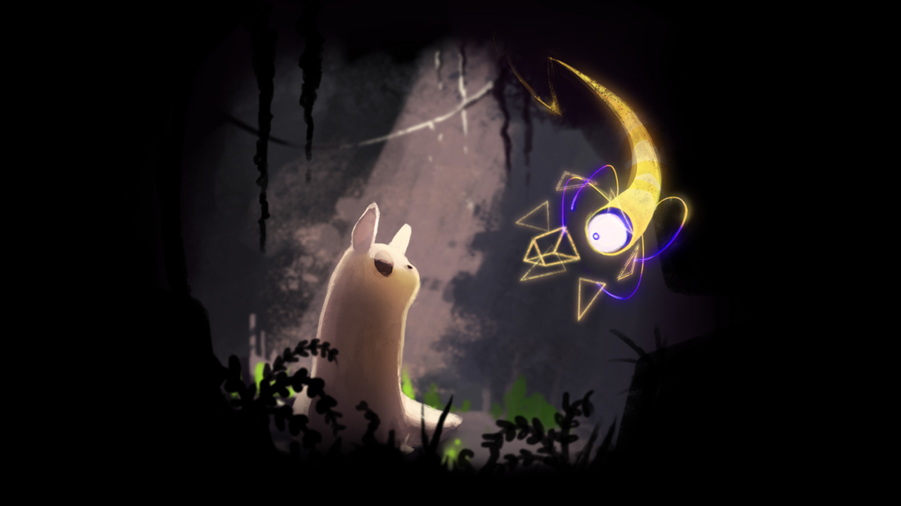

# 游戏·商品·艺术品
### 该笔记用于记录思考：有关游戏作为商品和艺术品的关系
### 类型：长期编辑、随记、杂记
---
有关于游戏、商品、艺术品之间的关系，是某天和CT老师在群里谈论Rainworld时候突然产生的想法。  

CT老师说：
> Rainworld的核心理念叫做：曼哈顿的老鼠。  
> 主角就像一个老鼠，一点一点熟悉了周边的一切，自己的能力没有提升，提升的只有生存经验。走向更大世界的时候，发现自己其实什么都不懂。  
> 
> Rainworld是作者有意把游戏做成现在这样，然后等着喜欢这种游戏的人。  
> 只是发行商明显不是这种人。吸引了人群的目光，随后得到了一大批差评退款。  
> 幸运的是，热度期过去之后好评率一路回升。  
> 
> 其实，这个世界的主角不是鼻涕猫，这个下雨跟那啥一样的世界才是主角。

我对这个话题的关注点在于，为什么这个游戏的评价会出现如此两极分化的状况？  
于是想到了