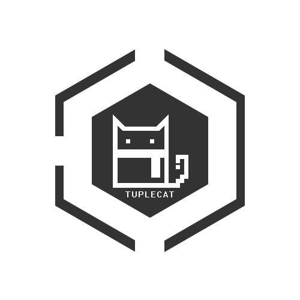

# Thinging About Indie Games
### 用于记录：对独立游戏的一些看法和想法
### 类型：长期编辑、随记
---
### #1 引言  
<!---->
首先，是并不是很重要的事——这个名字和这个形象的来由：  

  

很早之前，百度名字后，以“TinyTime”（小时代）为ID，后来，有人干脆称呼我为“小T”，  
默许了这个称呼之后，我干脆以“Small-T”作为自己的新ID。   
  
长大一点后，网络上的朋友们各奔东西，不再联系。渐渐的也没有人在叫我小T。  
翻遍了英文字典中所有以“T”开头的单词，瞄准了“Tuple”这个词。  
它的意思是“元组”，大致是“装着各种属性的一个容器”的意思。  
那段期间家里的小黑猫刚刚因病去世，结合着这份记忆，添加上了“Cat”，我最终确认了这个名字和这个形象。
  
从小，因为老爸的缘故，我也算得上是接触游戏比较多的一批90后。家里购入第一台游戏机的时候，我大概才五六岁。那之后，每天做的最多的事情大概就是坐在我哥和我爸两个人身后看着他们玩游戏，如果要说为什么不玩，一个是确实自己太小了操作跟不上，一个是那两个人没玩累之前是不会放下手柄的。

---
### #2 行业现状
<!--态度 原因 逐点展开-->

---
### #3 作为编码者:数学
---
### #4 桌游
---
### #5 游戏化
---
### #6 游戏与人生
---
### #7 所谓的游戏心理学
---
### #8 初衷与现实
---
### #9 艺术带给我的
---
### #10 游戏本质
---
### #11 憧憬与抱怨
---